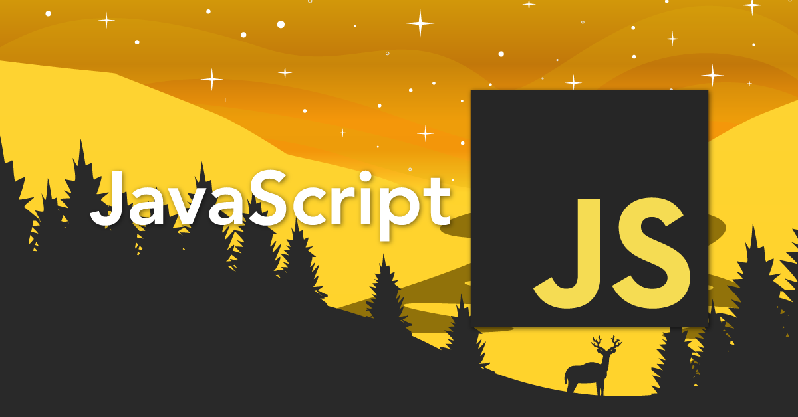

# Apprentissage JavaScript

Apprentissage en autodidacte : 01/2022

# Les bases de JavaScript

- [x] Le debugger
- [x] Constante
- [x] Les scopes (locale & globale)
- [x] Les événements JavaScript
- [x] Les tableaux et les objets
- [x] Les fonctions
- [x] Fonctions fléchées
- [x] La programmation orientée objet en JavaScript
- [x] Les promesses et les callbacks
- [x] Les modules en JavaScript
- [x] Le DOM (Document Object Model)
- [x] Manipulation du DOM avancée
- [x] Projet pratique
- [x] Framework JS (Vue.js) 
- [ ] Les API Web en JavaScript

